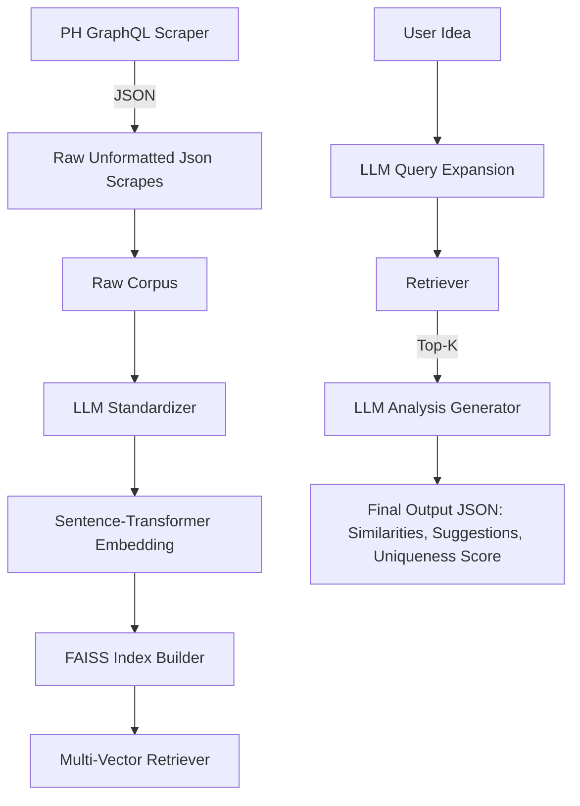

# toolate-api
> Helping AI builders, hackathon devs, and startup dreamers discover what hasn't been done.

---

## 🚀 Overview

**TooLate.ai** is an AI-powered research assistant and ideation tool that:
- Scrapes **real-time Product Hunt posts** and comments
- Enhances them using **LLM standardization**
- Indexes descriptions + feedback into **FAISS**
- Enables **semantic retrieval** of similar startups
- Generates RAG-based **startup analyses** with uniqueness scores and pivot suggestions

---
## Target Audience
- Indie hackers and engineers curious about startup ideas
- Students & hackathon participants
- Builders browsing YC or PH wanting to check if their idea is "Too Late"

**TooLate.ai bridges that gap with a vertical RAG system that makes LLMs aware of the unknown.**

---

## End-to-End Architecture



---

## Technology Stack
- **Python 3.13+**: All backend logic
- **FAISS**: Fast Approximate Nearest Neighbors Search
- **Sentence Transformers**: `all-mpnet-base-v2`
- **Together.ai**: LLMs for standardization and RAG
- **FastAPI**: API framework
- **GraphQL**: Product Hunt post scraper
- **NumPy / JSON**: Data handling

---

## File Structure

```bash
    TOOLATE-API/
    ├── .cache/
    │   ├── api/
    │   ├── corpus/
    │   ├── rag/
    │   └── scrapes/
    ├── app/
    │   ├── __pycache__/
    │   ├── core/
    │   │   ├── __pycache__/
    │   │   ├── config.py
    │   │   └── faiss_loader.py
    │   ├── data/
    │   │   ├── corpus/
    │   │   ├── rag/
    │   │   │   ├── indexes/
    │   │   │   ├── meta/
    │   │   │   └── scrapes/
    │   ├── routes/
    │   ├── services/
    │   ├── llm/
    │   ├── utils/
    │   └── main.py
    ├── scripts/
    │   ├── __pycache__/
    │   ├── api/
    │   ├── chores/
    │   ├── corpus/
    │   ├── rag/
    │   ├── scrape/
    │   └── tests/
    ├── venv/
    ├── .env
    ├── .gitignore
    ├── README.md
    └── requirements.txt

```

---

## Scraping Pipeline

### ✅ GraphQL Crawler for Product Hunt
- **Queries `artificial-intelligence` topic**
    - For MVP. Kept close consideration to ensure scalability across the entire api.
- Used caching to save progress at each run
    - Uses cursor-based pagination, cached to save progress at each run
    - Rate limit/wait aware (6250 complexity pts / 15min) using response headers (smartly waits and doesn't exceed limimt)
- Saves `ph_ai_db.json` and cache to `ph_ai_cache.json`
- Graceful shutdown with SIGINT
- Infinite mode with polite randomized backoff

#### Scrape Metrics (as of April 2025)
- Total unique AI-focused companies scraped: 23,569
    - Launch dates covered: April 2023 → April 2025
- Content Breakdown
    - Total unique entries extracted: 80,650
    - User Comments: 57,217
    - Ratio: ~ 12 : 5 (Comments : Posts)

---

## Standardization Layer

### ✅ `ph_raw_corpus.json`

Each json entry is converted to raw corpus structure.

### ✅ `ph_enhanced_corpus.json`

Each entry:
- Is passed through **LLM (Together.ai)** to produce a standardized summary
- Tagged with `enhancementVersion`, timestamp, `isEnhanced`
- Stores original + transformed content
- Entries chunked into types (connected via product_id):
  - `description` (product overview)
  - `comment` (top-voted user feedback)

### Batch processing pipeline:
- Not very efficient, so enhancing randomly sampled batches of unenhanced entries from raw_corpus
- Saves every batch, and saves progress on crash/interruption.
- Resumes gracefully at each run of the script using progress caches

### Limitations:
- Considering free LLM rate limits
- TogetherAi doesn't support multithreading

### Enhancement Metrics (as of April 2025)
- Total unique entries in raw: 80,650
- ~6200 unique enhanced entries saved in `ph_enhanced_corpus.json`, which current RAG uses
    - ~2500: 3700 desc:comment ratio

---

## Embedding + Indexing

### ✅ Dual Vector Indices

Separate indexes built for:
- **Descriptions**: standard product overviews
- **Comments**: informal sentiment, suggestions, pain points

Built using Sentence Transformers:
```env
ST_MODEL=sentence-transformers/all-mpnet-base-v2
```

Each item:
- Gets `standardized` field embedded
- Indexed via FAISS (`IndexFlatL2`)
- Saved to `.faiss` and `.npy`

---

## Retrieval Engine

### ✅ Query Expansion via LLM
- Expands vague ideas like "Uber for mental health" to 3–5 diverse phrasings
- Uses sentence embeddings for each

### ✅ Multi-Source Retrieval
- Searches both `desc_index` and `comment_index`
- Combines top results, groups by company

---

## RAG Prompting

Query results are injected into RAG prompt for analysis.

**Output Format:** Markdown-like JSON object:
```json
{
  "similarities": "...",
  "differences": "...",
  "suggestions": "...",
  "uniqueness_score": "..."
}
```

---

## 🧪 API Usage (FastAPI)
- `/api/query` → Accepts user idea → returns grouped matches
- `/api/analyze` → Accepts idea + results → returns full RAG analysis

---

## Run Locally
### Start Server
`uvicorn app.main:app --reload`

## Set Environment Variables
```env
# 🔐 Together API Keys for LLM Calls
CORPUS_LLM_API_KEY=your_primary_llm_key # Used for corpus standardization (automated calls and large rates)
QUERY_LLM_API_KEY=your_secondary_llm_key  # Used for user input analysis (manual calls by user and less rates)

# 🧠 Model Names
TOGETHER_MODEL=meta-llama/Llama-3.3-70B-Instruct-Turbo
ST_MODEL=sentence-transformers/all-mpnet-base-v2

# ⚙️ Runtime Configs
OMP_NUM_THREADS=1
TOKENIZERS_PARALLELISM=false

# 🔑 Product Hunt API Credentials
PH_CLIENT_ID=your_ph_client_id
PH_CLIENT_SECRET=your_ph_client_secret
```

## app.core.config
This is where all the indexing sentence-transformers, query expander, and indexing config lies.
```config
import os

# === LLM Configuration ===
LLM_MODEL_TYPE = "Together"
LLM_MODEL_NAME = "meta-llama/Llama-3.3-70B-Instruct-Turbo"

# === Embedding Model ===
EMBED_MODEL_NAME = "sentence-transformers/all-mpnet-base-v2"

# === FAISS Index Paths ===
INDEX_DIR = "app/data/rag/indexes"
DESCRIPTION_INDEX_PATH = os.path.join(INDEX_DIR, "desc_index.faiss")
COMMENT_INDEX_PATH     = os.path.join(INDEX_DIR, "comment_index.faiss")

# === Metadata Storage ===
META_DIR = "app/data/rag/meta"
DESCRIPTION_META_PATH = os.path.join(META_DIR, "desc_metadata.json")
COMMENT_META_PATH     = os.path.join(META_DIR, "comment_metadata.json")

# === Corpus Files ===
CORPUS_DIR = "app/data/corpus"
RAW_CORPUS_PATH      = os.path.join(CORPUS_DIR, "ph_raw_corpus.json")
ENHANCED_CORPUS_PATH = os.path.join(CORPUS_DIR, "ph_enhanced_corpus.json")
```

---

## 📊 MVP Highlights
- Full-stack vertical RAG pipeline from real-time web data
- Owns scraping → enhancement → indexing → querying → feedback loop
- Handles hard LLM blindspots (post-2023 startups)
- Uses both product summaries + real user feedback
- Modular, resumable, rate-limited-safe architecture
- Can be scaled up to include Crunchbase, YC, IndieHackers

---

## 🛣️ Next Steps
- Locally host and deploy scalable + fast fine-tuned LLM for internal enhancement
- Diversify sources: Indie Hackers, Failory, Twitter etc.
- Cross-encoder reranking to improve semantic precision

---